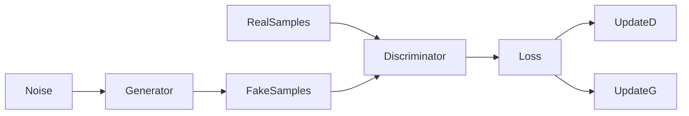
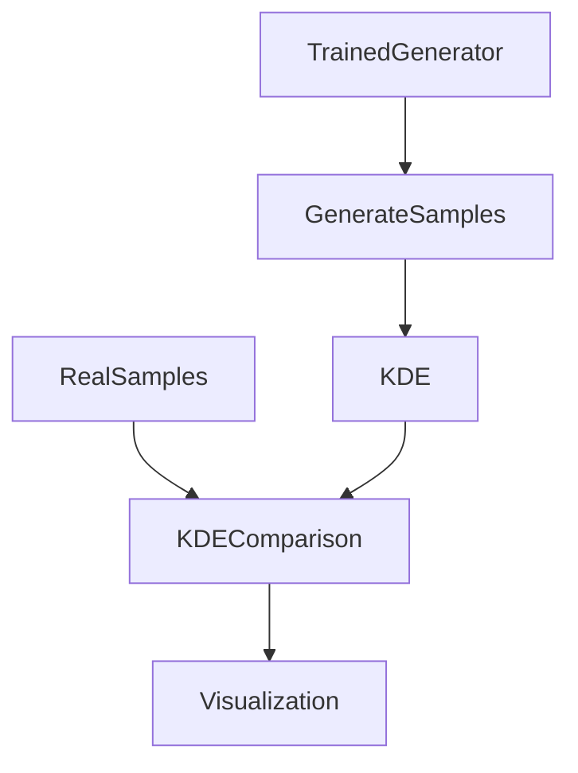

# PDF Estimation using GAN on Transformed NO₂ Data

## Overview

This project implements probability density estimation using a Generative Adversarial Network (GAN) on a transformed environmental dataset. Instead of assuming a parametric form (e.g., Gaussian), we learn the distribution directly from data using an implicit generative model.

The goal is to:

1. Load and clean the NO₂ feature from the dataset.
2. Apply a nonlinear roll-number-parameterized transformation.
3. Train a 1D GAN to learn the transformed distribution.
4. Generate synthetic samples from the trained generator.
5. Estimate and visualize the learned probability density.
6. Quantitatively evaluate distribution similarity using Wasserstein distance.

---

## Dataset and Feature Extraction

The dataset is loaded from:

```
DATA/data.csv
```

We extract the `no2` column and perform the following cleaning steps:

* Remove missing values.
* Convert to numeric format.
* Drop any non-convertible entries.

After cleaning, we obtain the feature vector:

$$
x = \{x_1, x_2, \ldots, x_n\}
$$

Basic statistics are computed for sanity verification:

* Total samples
* Mean
* Standard deviation

---

## Nonlinear Transformation

Each value of $x$ is transformed into $z$ using:

$$
z = x + a_r \sin(b_r x)
$$

Where:

$$
a_r = 0.05 (r \bmod 7)
$$

$$
b_r = 0.3 ((r \bmod 5) + 1)
$$

Here, $r$ is the university roll number (taken as $r = 102303592$).

This transformation introduces structured nonlinearity into the feature space.

---

## GAN-Based Density Learning

Instead of fitting a parametric distribution, we train a Generative Adversarial Network to learn the distribution of $z$.

### GAN Architecture

We use a 1D GAN consisting of:

* **Generator**: maps Gaussian noise to synthetic samples.
* **Discriminator**: distinguishes real samples from generated ones.

The final architecture used (best performing version):

**Generator:**

* Linear(1 → 32)
* ReLU
* Linear(32 → 64)
* ReLU
* Linear(64 → 1)

**Discriminator:**

* Linear(1 → 128)
* LeakyReLU(0.2)
* Linear(128 → 128)
* LeakyReLU(0.2)
* Linear(128 → 64)
* LeakyReLU(0.2)
* Linear(64 → 1)
* Sigmoid

### Training Strategy

* Loss: Binary Cross Entropy
* Optimizer: Adam
* Learning rate: 5e-5
* Discriminator trained twice per generator step
* Large batch size to utilize GPU efficiently

### GAN Training Flow



Training progresses adversarially until discriminator predictions approach 0.5, indicating that generated samples are indistinguishable from real samples.

---

## Sample Generation and Density Estimation

After training stabilizes:

1. Generate 200,000 synthetic samples from the generator.
2. Estimate the density using Kernel Density Estimation (KDE).
3. Compare real and generated distributions.

Three visualizations are produced and saved in the `images/` folder:

* `images/density_central.png` — Central 99% density comparison
* `images/density_logscale.png` — Log-scale tail comparison
* `images/full_pdf_overlay.png` — Full PDF overlay

### Distribution Comparison Flow



---

## Visual Interpretation

### Central 99% Density

The GAN captures the main mass of the distribution reasonably well. The peak and general decay structure are approximated, though fine multimodal structures are partially smoothed.

### Log-Scale Tail

The log-scale plot reveals that the GAN approximates tail decay but underrepresents extreme rare events. This is expected behavior in vanilla GAN training.

### Full PDF Overlay

The overall trend of the distribution is captured. However:

* The learned distribution is smoother.
* Minor local fluctuations in the real distribution are not fully reproduced.

This reflects the smoothing nature of implicit density learning.

---

## Quantitative Evaluation

We compute the Wasserstein-1 distance between real and generated samples:

```
Wasserstein Distance: 3.99
```

Interpretation:

* The distance is measured in the same units as $z$.
* Relative to the data standard deviation, this indicates a reasonably close match.
* The generator approximates the distribution trend, though not perfectly.

---

## Key Observations

* GAN successfully learns the overall structure of the transformed distribution.
* Fine-grained multimodal features are smoothed.
* Tail behavior is approximated but not exact.
* Wasserstein distance confirms reasonable alignment between distributions.

---

## Conclusion

This project demonstrates implicit probability density learning using GANs without assuming any parametric form. The trained generator approximates the true distribution of the transformed variable through adversarial learning.

While exact recovery of multimodal fine structure remains challenging with a vanilla GAN, the model successfully captures the dominant distributional characteristics and provides a valid generative representation of the data.

---

## Folder Structure

```
PDF-Estimator-GAN/
│
├── DATA/
│   └── data.csv
│
├── images/
│   ├── density_central.png
│   ├── density_logscale.png
│   └── full_pdf_overlay.png
│
├── pdf_gan.ipynb
├── requirements.txt
└── README.md
```

---

## Requirements

* Python 3.10+
* PyTorch
* NumPy
* Pandas
* Matplotlib
* SciPy
* scikit-learn

Install via:

```
pip install -r requirements.txt
```

---

This repository provides a complete pipeline from raw data preprocessing to adversarial density estimation and quantitative evaluation.
